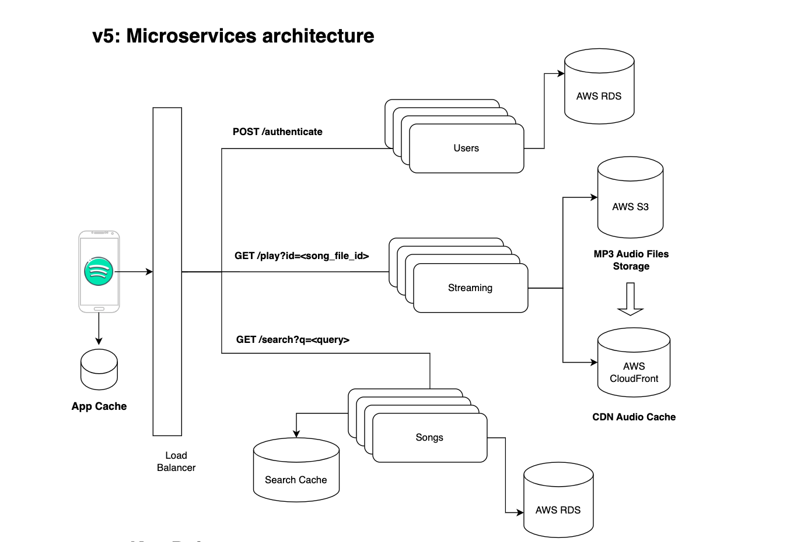
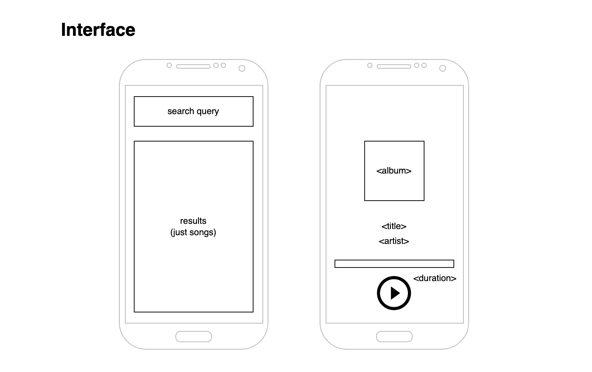

# Spotify System Architecture Design

This document provides a simplified overview of core components and design considerations for a music streaming service like Spotify, focusing on foundational elements. While real-world Spotify architecture likely involves more complex implementations and technologies, this document focuses on finding and playing music.

### Explore the diagram
**[🎶 Spotify Architecture Design Process](https://viewer.diagrams.net/?tags=%7B%7D&highlight=CCCCCC&edit=_blank&layers=1&nav=1&page-id=IPoKcTMe5D6ODKx1SfrH&title=spotify.drawio#Uhttps%3A%2F%2Fraw.githubusercontent.com%2Fagustin-chavez%2Fdiagrams%2Fmain%2Fspotify%2Fspotify.drawio)**

#### Final Result (v5)

**System Scope:**

* Manages core entities:
    * **Users:** Represents active users of the platform. (Target: 1 billion)
    * **Songs:** Stores metadata information about songs. (Number of songs: 100 million)
    * **Files:** Stores actual audio files (MP3 format, average size: 5 MB) for streaming.

**Use Cases:**

* **Finding Music:** Users can search for music from a search bar in the app.
* **Playing Music:** Users can seamlessly play songs with minimal latency.

**Metrics and Considerations:**

* **Scalability:** The system needs to handle a large user base (1 billion) and a vast music library (100 million songs).
* **Storage:** The total estimated audio storage requirement is 0.5 PB, with additional space needed for replication (total storage: 2 PB). 
* **Data Access:** A relational database like MySQL or AWS RDS is suitable for handling high-volume song searches based on metadata.
* **Audio Delivery:** AWS S3 is a potential solution for storing and directly accessing large, static audio files for streaming.

**Insights:**

This simplified overview highlights the importance of scalable storage solutions like AWS S3 for handling a massive music library and a relational database for efficient song searches based on user queries. While this doesn't cover all aspects of a real-world Spotify architecture, it provides a foundational understanding of key considerations.

**Future Considerations:**

* Exploring solutions for managing additional entities like playlists, artists, and podcasts.
* Addressing traffic patterns and scaling the web service for optimal performance.

